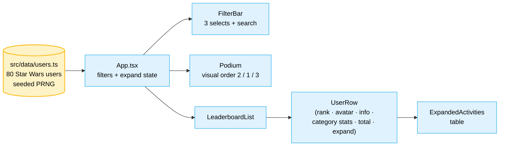

# Task-1 — The Clone Wars Leaderboard

> A pixel-faithful React replica of an internal corporate leaderboard, populated
> with fully synthetic Star Wars data, deployed on GitHub Pages.

**Live**: <https://warhammer2000.github.io/Task-1/>

Built as Task 1 of [Vention AI Challenge 2.0](https://github.com/Warhammer2000/ai-challenge-2026) (theme:
*vibe coding*). The brief: replicate an internal leaderboard exactly — every
filter, every sort behavior, every UI element — with **all data replaced** so
no real names, titles, or department codes appear in the artifact.

The cross-task working repo (with internal artifacts, planning, self-review
gates, and a Mahoraga-style retrospective adapter) lives at
[`Warhammer2000/ai-challenge-2026`](https://github.com/Warhammer2000/ai-challenge-2026).
This repo is the standalone, public-facing submission for **Task 1 only**.

---

## What's in here

A single-page React app that mirrors the original leaderboard's three-category
structure (mapped to a Star Wars theme):

| Original category    | Replica category    | Activity prefixes |
|----------------------|---------------------|-------------------|
| Education            | Padawan Training    | `[KYB]`           |
| Public Speaking      | Galactic Diplomacy  | `[OBI]` / `[SEN]` |
| University Partnership | Temple Partnership | `[TMP]`           |

Same 3-category, 4-prefix distribution as the source. Same UI elements:
header, three-filter bar (year / quarter / category) + employee search, top-3
podium with gold / silver / bronze ranks, expandable rows with a `Recent
Activity` table per user.

80 fully synthetic users — names, roles, location codes, activities, and dates
all drawn from the Star Wars universe via a deterministic seeded PRNG.

---

## Quickstart

```bash
npm install
npm run dev
# open http://localhost:5173/Task-1/
```

Build: `npm run build` → `dist/`.
Deploy: `npm run deploy` (pushes `dist` to the `gh-pages` branch).

## Tech stack

- **Vite 8** + **React 19** + **TypeScript 6**
- **Tailwind CSS 3.4** — palette mirrors the original (slate / sky / amber / yellow), zero custom theme tokens
- **`gh-pages`** for deploy
- **DiceBear `bottts`** SVG avatars (free, no API key) for ~22 famous characters; the rest fall back to deterministic initials placeholders

## Architecture



## Project structure

```
.
├── src/
│   ├── components/      Avatar · FilterBar · Podium · PodiumColumn ·
│   │                    UserRow · ExpandedActivities · LeaderboardList ·
│   │                    CategoryStat · CategoryBadge · TotalScore · icons
│   ├── data/            categories.ts · users.ts (deterministic generator)
│   ├── lib/             dates, initials, computed (filter / sort logic)
│   ├── types/           shared TypeScript interfaces
│   ├── App.tsx          composition root + state
│   ├── main.tsx         React mount
│   └── index.css        Tailwind directives + global resets
├── public/              static assets (favicon)
├── index.html
├── package.json
├── vite.config.ts
├── tailwind.config.js
├── tsconfig*.json
├── eslint.config.js
├── report.md            required write-up: approach, tools, RAI strategy
├── leaderboard-spec.md  reverse-engineered structural spec (no corporate data)
├── README.md            this file
└── LICENSE              MIT
```

## Why the data is what it is

The brief explicitly forbids feeding any corporate data into AI tools and
forbids it from appearing in the artifact. So the structure of the original
was inspected via DOM-shape and computed-style queries (no real names, no
photos), and the dataset was built fresh from the Star Wars universe. See
[`report.md`](./report.md) for the full data-replacement approach.

## License

[MIT](./LICENSE).
